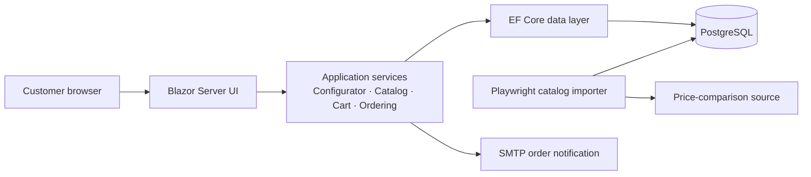

# PCWerk — Custom-PC Commerce Platform

PCWerk is a full-stack e-commerce application for a Swiss custom-PC workshop. It lets customers browse ready-made PCs and laptops, assemble a compatible PC from individual components, add it to a persistent cart, and place an order. Product data is imported from a market-price source and stored locally, so the storefront can offer fast filtering, consistent pricing, and a controlled checkout experience.

This repository is designed as a portfolio project: it demonstrates an end-to-end .NET solution with a customer-facing UI, domain-oriented services, relational data modelling, data ingestion, and automated tests.

## Highlights

- **Interactive PC configurator** that evaluates component compatibility while the customer builds a system, including CPU socket, GPU, PSU, cooling, case, and integrated-graphics rules.
- **Catalog experience** for curated PC presets and laptops, with search, sorting, and filters.
- **Reliable checkout flow** that revalidates prices and availability before an order is persisted, preventing stale-cart purchases.
- **Durable order processing** with PostgreSQL persistence and SMTP order notifications. An email outage is recorded separately and does not discard a successfully saved order.
- **Multilingual UI** with German as the fallback language and English, French, Italian, and Polish translation resources.
- **Browser-backed cart persistence** protected with ASP.NET Core Data Protection and refreshed against the live catalog on a later visit.
- **Catalog importer** built with Playwright that collects ranked products, offers, specifications, price history, and automatically generated PC presets.
- **Automated unit tests** covering compatibility rules, cart refresh behaviour, pricing, parsers, importer options, and email rendering.

## Architecture



The solution separates responsibilities deliberately:

- `web` contains the ASP.NET Core host, Blazor components, page-specific styling, client-side persistence helpers, and localisation assets.
- `common/services` holds the business rules: configuration compatibility, catalog reads, price refresh, cart operations, order placement, email composition, and translations.
- `common/EFDB` contains the EF Core context and persistence entities, keeping database concerns outside the UI and domain services.
- `tools/Toppreise.Catalog.Import` is an independent console application for ingesting and normalising catalog data.
- `db` is the database source of truth, including initial schema and incremental upgrade scripts.

## Technology stack

| Area | Technologies |
| --- | --- |
| Application | C# / .NET 10, ASP.NET Core, Blazor Server (interactive server rendering) |
| UI | Razor components, Bootstrap 5, CSS, vanilla JavaScript |
| Data | Entity Framework Core 10, Npgsql, PostgreSQL |
| Ingestion | Microsoft Playwright, Serilog |
| Quality | xUnit, Microsoft.NET.Test.Sdk |
| Localisation | JSON translation dictionaries |

## Key engineering decisions

### Compatibility lives in the service layer

The configurator is not just a UI form. `PcBuilderService` owns the compatibility rules and pricing logic, so the same domain decisions are independent of component rendering and can be tested directly. Invalid selections are rejected or dependent selections are reset when a change makes the configuration incompatible.

### The catalog is authoritative at checkout

The cart is a convenience layer, not the source of truth. On restore and again immediately before order placement, `CartRefreshService` queries the current catalog. The customer is asked to review the cart if a price changed or a product is no longer available.

### Orders and notifications fail independently

`OrderService` persists the order before sending notification email. If SMTP is temporarily unavailable, the order remains durable and the failure is stored for operational follow-up. This avoids duplicated customer orders caused by a notification-only failure.

### Imported data retains useful history

The PostgreSQL model covers products, typed hardware specifications, retailers, current offers, offer observations, category rankings, import runs, and import errors. It supports both customer-facing reads and traceable import operations rather than treating scraped data as an unstructured snapshot.

## Repository structure

```text
.
├── web/                                  # Blazor Server storefront
│   ├── Components/                        # Pages, layout, home, catalog and configurator UI
│   ├── Services/                          # Browser cart persistence
│   ├── wwwroot/                           # CSS, JavaScript, images and translations
│   ├── Program.cs                         # Dependency injection and HTTP pipeline
│   └── PcSell.csproj
├── common/
│   ├── services/                          # Business logic and domain models
│   ├── services.Tests/                    # Service-level unit tests
│   └── EFDB/                              # DbContext, entities and specifications
├── tools/
│   ├── Toppreise.Catalog.Import/          # Playwright-based catalog importer
│   └── Toppreise.Catalog.Import.Tests/    # Importer and parser tests
├── db/                                    # Schema and database upgrade scripts
└── PcSell.slnx                            # Solution definition
```

## Getting started

### Prerequisites

- .NET 10 SDK
- PostgreSQL 14+ (the application uses the Npgsql provider)
- A PostgreSQL database named `pcwerk`
- A Playwright-supported browser if you plan to run the importer

### 1. Create the database schema

Create an empty `pcwerk` database, then execute the initial schema:

```powershell
psql -U postgres -d pcwerk -f db/create.sql
```

For an existing database, apply the relevant scripts in `db/` instead of recreating it. The upgrade scripts are intended for databases created before their corresponding feature was added.

### 2. Configure local secrets

Keep database and SMTP credentials out of source control. The application accepts standard ASP.NET Core environment-variable overrides; use double underscores for nested configuration keys.

```powershell
$env:ConnectionStrings__PcWerk = "Host=localhost;Port=5432;Database=pcwerk;Username=YOUR_USER;Password=YOUR_PASSWORD"
$env:Email__Host = "smtp.example.com"
$env:Email__Port = "587"
$env:Email__EnableSsl = "true"
$env:Email__UserName = "YOUR_SMTP_USER"
$env:Email__Password = "YOUR_SMTP_PASSWORD"
$env:Email__FromAddress = "orders@example.com"
$env:Email__OrderRecipient = "orders@example.com"
```

Configure `SiteContact` values in environment-specific settings or environment variables as appropriate for your deployment. Use a secret store or platform-managed configuration for production.

### 3. Restore and run the storefront

```powershell
dotnet restore PcSell.slnx
dotnet run --project web/PcSell.csproj
```

Open the local URL printed by ASP.NET Core. The home page is available at `/`; dedicated catalog pages are available at `/pcs` and `/laptops`, with checkout at `/cart`.

## Catalog importer

The importer populates or refreshes the PostgreSQL catalog from Toppreise. It reads selected categories, ranks and product pages; normalises hardware specifications and offers; records import observations and errors; and then generates viable PC presets from compatible components.

```powershell
# Full catalog refresh
dotnet run --project tools/Toppreise.Catalog.Import

# Regenerate PC presets from data already stored in PostgreSQL
dotnet run --project tools/Toppreise.Catalog.Import -- --presets-only
```

Configure the connection string and enabled categories in the importer's settings before running it. The importer uses a visible Playwright browser by default so an operator can complete an access verification if the source requests one. Ensure that data collection complies with the source's terms and applicable law.

## Tests

Run all automated tests from the solution root:

```powershell
dotnet test PcSell.slnx
```

The test suite is intentionally focused on business behaviour and import reliability, including component compatibility, catalog-price refreshes, laptop price calculation, product parsing, preset generation, CLI arguments, and SMTP email output.

## Security and publication checklist

Before publishing or deploying a fork of this project:

- Use environment variables, a secret manager, or a managed secret store for all connection strings and SMTP credentials.
- Ensure that configuration files and Git history do not contain real passwords, API tokens, or production connection details; rotate any credential that may have been exposed.
- Use a production SMTP account and a real sender domain only after the ordering workflow has been reviewed for the target business.
- Review the importer configuration and the data source's permitted-use requirements.

## Portfolio talking points

This project is a useful code-sample discussion starter because it brings several concerns together in one coherent product:

- modelling a commercial hardware domain with compatibility constraints;
- maintaining clean boundaries between interaction, business logic, persistence, and external integration;
- protecting a real purchase flow from changing market data;
- designing an importer that preserves operational history and continues safely when individual external calls fail; and
- delivering a responsive, localised customer experience without moving domain logic into the UI.

---

Built as a full-stack custom-PC commerce and catalog-management solution.
